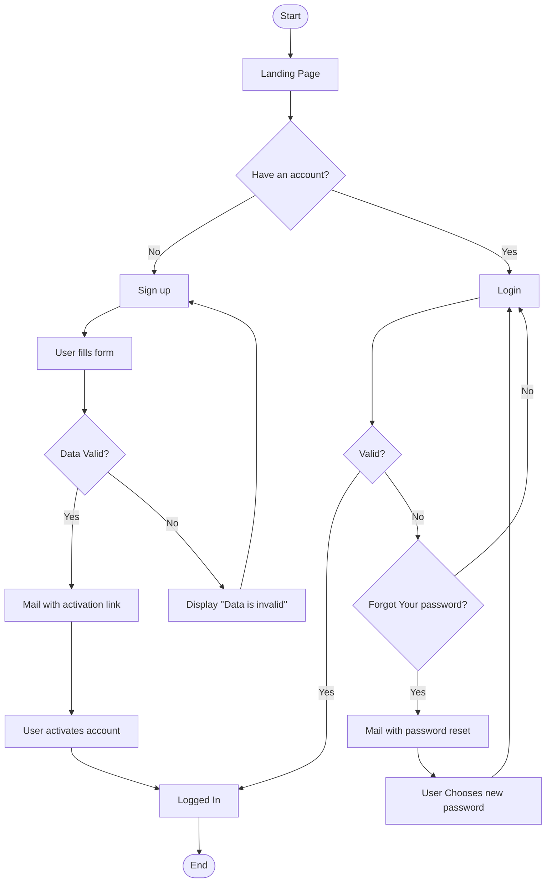
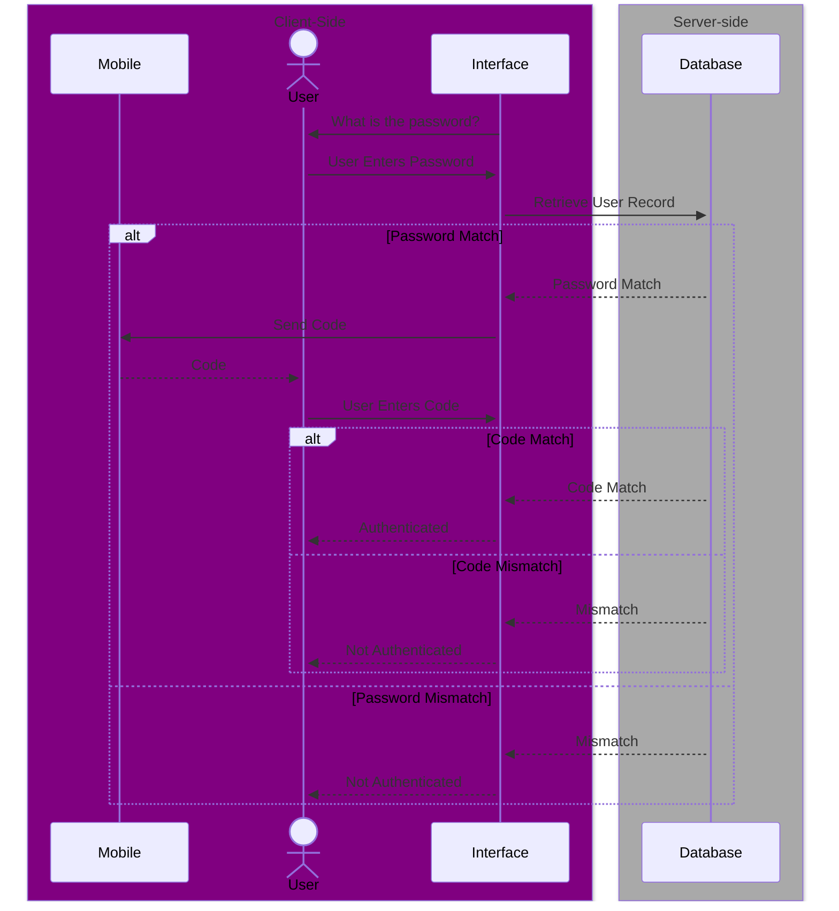
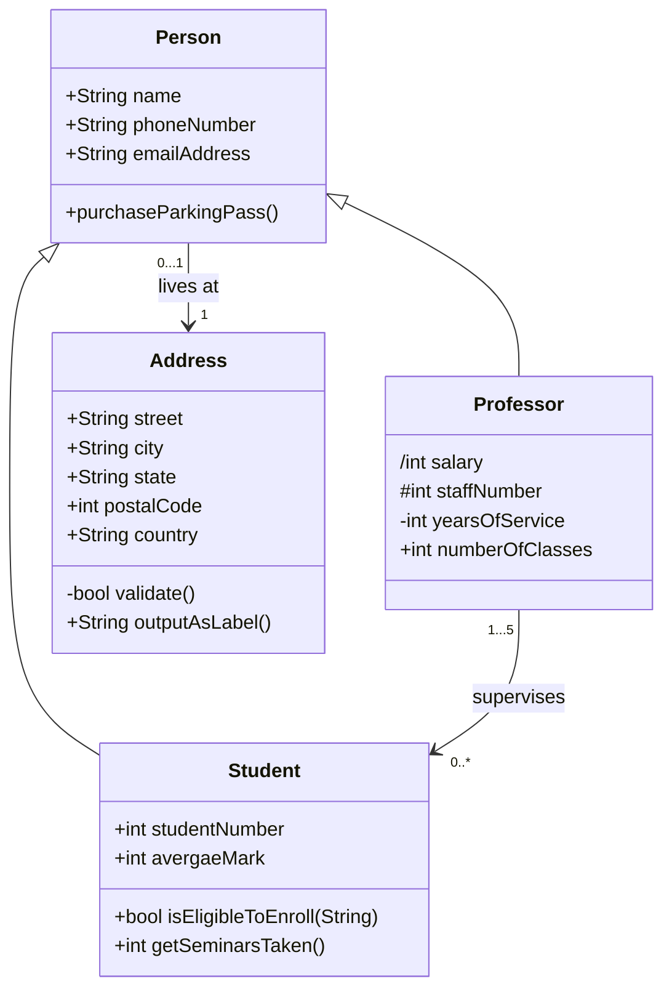

# Mermaid-Practice
Test repo for practicing mermaid js

## Flowchart

```mermaid
flowchart TD
    A([Start]) --> B[Landing Page]
    B --> C{Have an account?}
    C --> |No| K[Sign up]
    C -->|Yes| D[Login]
    D ---> E{Valid?}
    E --> |Yes| F[Logged In]
    F --> G([End])
    E --> |No| H{Forgot Your password?}
    H --> |Yes| I[Mail with password reset]
    I --> J[User Chooses new password]
    K --> L[User fills form]
    L --> M{Data Valid?}
    M --> |Yes| N[Mail with activation link]
    N --> O[User activates account]
    O --> F
    M --> |No| P[Display ''Data is invalid'']
    P --> K
    J --> D
    H --> |No| D
```

## Sequence Diagram

```mermaid
sequenceDiagram
    box Purple Client-Side
    participant Mobile
    actor User
    participant Interface
    end
    box DarkGrey Server-side
    participant Database
    end

    %% Prompt user for password
    Interface->>+User: What is the password?
    User->>+Interface: User Enters Password
    Interface->>+Database: Retrieve User Record
    
    %% Password validation decision point
    
    alt Password Match
        Database-->>Interface: Password Match
        Interface->>Mobile: Send Code
        Mobile-->>User: Code
        User->>Interface: User Enters Code
        
        %% Code validation decision point
        alt Code Match
            Database-->>Interface: Code Match
            Interface-->>User: Authenticated
        else Code Mismatch
            Database-->>Interface: Mismatch
            Interface-->>User: Not Authenticated
        end
    else Password Mismatch
        Database-->>Interface: Mismatch
        Interface-->>User: Not Authenticated
    end
```

## Class Diagram

```mermaid
classDiagram
    Person <|-- Student
    Person <|-- Professor
    Person : +String name
    Person : +String phoneNumber
    Person : +String emailAddress
    Person: +purchaseParkingPass()
    Person "0...1" --> "1"Address: lives at

    class Address{
        +String street
        +String city
        +String state
        +int postalCode
        +String country
        -bool validate()
        +String outputAsLabel()
    }
    
    class Professor{
        /int salary
        #int staffNumber
        -int yearsOfService
        +int numberOfClasses
    }

    class Student {
        +int studentNumber
        +int avergaeMark
        +bool isEligibleToEnroll (String)
        +int getSeminarsTaken()
    }

    Professor "1...5" --> "0..*"Student: supervises
```
